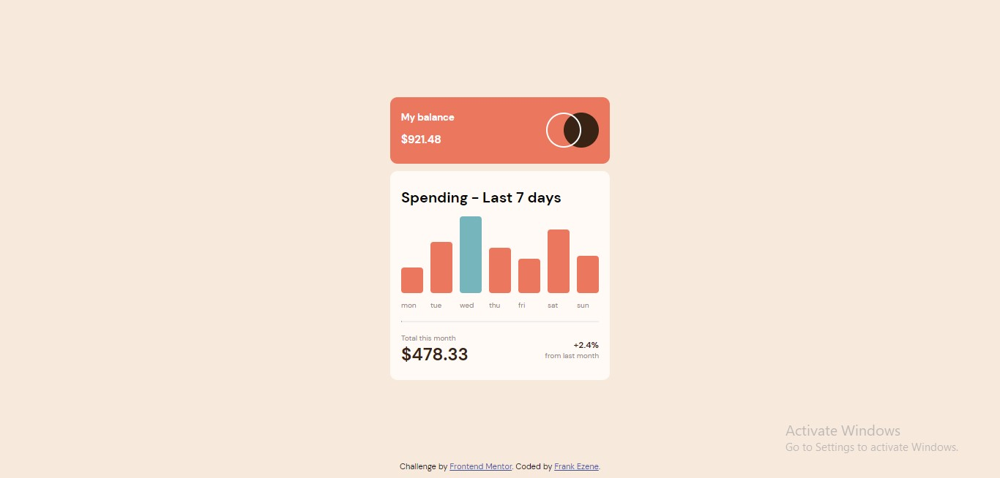

# Frontend Mentor - Expenses chart component solution

This is a solution to the [Expenses chart component challenge on Frontend Mentor](https://www.frontendmentor.io/challenges/expenses-chart-component-e7yJBUdjwt). Frontend Mentor challenges help you improve your coding skills by building realistic projects. 

## Table of contents

- [Overview](#overview)
  - [The challenge](#the-challenge)
  - [Screenshot](#screenshot)
  - [Links](#links)
- [My process](#my-process)
  - [Built with](#built-with)
  - [What I learned](#what-i-learned)
- [Author](#author)

## Overview

### The challenge

Users should be able to:

- View the bar chart and hover over the individual bars to see the correct amounts for each day
- See the current day’s bar highlighted in a different colour to the other bars
- View the optimal layout for the content depending on their device’s screen size
- See hover states for all interactive elements on the page
- **Bonus**: Use the JSON data file provided to dynamically size the bars on the chart

### Screenshot


### Links

- Solution URL: [https://www.frontendmentor.io/solutions/expenses-chart-component-solution-using-typescript-xQliehG9-i](https://www.frontendmentor.io/solutions/expenses-chart-component-solution-using-typescript-xQliehG9-i)
- Live Site URL: [https://expenses-chart-component-beryl.vercel.app/](https://expenses-chart-component-beryl.vercel.app/)

## My process

### Built with

- Semantic HTML5 markup
- CSS custom properties
- Flexbox
- HTML Inline Styling 
- Mobile-first workflow
- Typescript

### What I learned

I implemented reusable functions.

code snippets:
```js
const getMax = (arr: any[], value: string) => {
  let max = 0;
  let map = arr.map((d) => d[value]);
  max = Math.max(...map);
  return max;
};
```

## Author

- LinkedIn - [https://www.linkedin.com/in/frank-ezene-454679171/](https://www.linkedin.com/in/frank-ezene-454679171/)
- Frontend Mentor - [frank1003a](https://www.frontendmentor.io/profile/frank1003A)
- Twitter - [@FrankEzene](https://twitter.com/FrankEzene)

